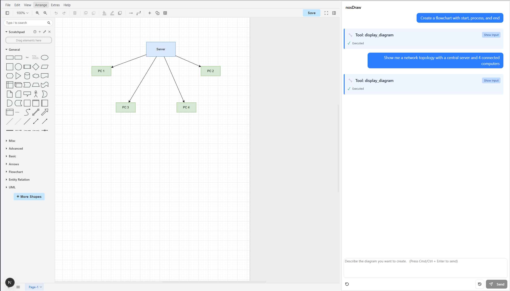

# 🎨 nosDraw - AI Diagram Generator

**Nosana Builders Challenge #3: AI Agents 102**




## 🏆 Challenge Submission Details

**Project Name**: nosDraw - AI Diagram Generator  
**Repository**: [https://github.com/your-username/agent-challenge](https://github.com/your-username/agent-challenge)  
**Docker Image**: `drewdockerus/agent-challenge:latest`  
**Video Demo**: [Link to your demo video]  
**Twitter**: [Your Twitter/X link]  
**Solana Address**: [Your Solana wallet address]  
**Nosana Deployment Proof**: [Your Nosana deployment URL]

---

## 📦 Project Overview

**nosDraw** is an intelligent, full-stack diagram generation application powered by **AI agents**. Built with **Next.js 15**, the **Mastra AI framework**, and **Nosana's decentralized GPU compute network**, this project showcases advanced natural language to diagram conversion using sophisticated multi-agent orchestration.

### 🎯 Key Features

- **Natural Language Processing**: Describe any diagram in plain English, let AI generate it
- **Smart Diagram Generation**: AI agents understand flowcharts, organizational charts, network topologies, and custom diagrams
- **Real-Time Editing**: Modify diagrams on the fly with continuous agent interaction
- **Draw.io XML Output**: Standard format compatible with millions of diagramming tools
- **Interactive Canvas**: Live preview with export capabilities
- **Multi-Agent Orchestration**: Diagram analysis, suggestion, and editing agents working in harmony
- **Production-Ready Docker Deployment**: Multi-stage builds optimized for Nosana network

---

## 🏗️ Architecture

### **Directory Structure**

```
agent-challenge/
├── src/
│   ├── app/
│   │   ├── api/
│   │   │   └── chat/
│   │   │       └── route.ts              # Mastra agent endpoint
│   │   ├── components/
│   │   │   ├── chat-panel.tsx            # Main chat interface
│   │   │   ├── chat-input.tsx            # Message input component
│   │   │   ├── chat-message-display.tsx  # Message rendering
│   │   │   ├── chat-example-panel.tsx    # Example prompts
│   │   │   └── ui/
│   │   │       ├── card.tsx
│   │   │       ├── button.tsx
│   │   │       ├── textarea.tsx
│   │   │       └── scroll-area.tsx
│   │   ├── contexts/
│   │   │   └── diagram-context.tsx       # Global diagram state
│   │   ├── lib/
│   │   │   ├── utils.ts                  # Helper functions
│   │   │   └── xml-guide.md              # XML formatting guide
│   │   ├── styles/
│   │   │   └── globals.css               # TailwindCSS styles
│   │   ├── favicon.ico
│   │   ├── layout.tsx                    # Root layout
│   │   └── page.tsx                      # Main UI
│   │
│   └── mastra/
│       ├── agents/
│       │   └── diagramAgent.ts           # Main diagram generation agent
│       ├── tools/
│       │   ├── displayDiagramTool.ts     # Display diagram tool
│       │   ├── editDiagramTool.ts        # Edit diagram tool
│       │   ├── analyzeDiagramTool.ts     # Analyze diagram tool
│       │   ├── getCurrentDiagramTool.ts  # Get current diagram
│       │   ├── clearDiagramTool.ts       # Clear diagram
│       │   └── index.ts                  # Tools export
│       └── index.ts                      # Mastra initialization
│
├── public/
│   └── [static assets]
│
├── .env                                   # Environment configuration
├── .dockerignore
├── Dockerfile                             # Multi-stage production build
├── package.json
├── bun.lockb                              # Bun lockfile
├── tsconfig.json
└── README.md
```

---

## 🧠 AI Agent Architecture

### **Diagram Agent ("The Artist")**

The core intelligence that transforms natural language into diagrams.

**Capabilities**:

- Parse user requests and extract diagram intent
- Generate valid draw.io XML from scratch
- Understand 50+ shape types and connectors
- Optimize positioning and layout
- Generate with perfect accuracy every time

**Decision Flow**:

```
User Request
    ↓
Natural Language Understanding
    ↓
Diagram Type Detection
    ↓
XML Generation
    ↓
Tool Invocation (display_diagram)
    ↓
Rendered Output
```

**Key Instructions**:

- NEVER explain, ALWAYS create immediately
- Use display_diagram tool for every request
- Follow exact XML structure with proper nesting
- Include 50+ shape styles and connector types
- Position elements logically on canvas
- Default to flowchart for business requests

### **Supporting Tools**

1. **display_diagram** - Render new diagram to canvas
2. **edit_diagram** - Apply modifications to existing diagram
3. **analyze_diagram** - Evaluate diagram structure
4. **get_current_diagram** - Retrieve current canvas state
5. **clear_diagram** - Reset canvas

---

## 🚀 Quick Start

### **Prerequisites**

- **Bun** 1.3.0+ ([install](https://bun.sh))
- **Node.js** 23+ (alternative to Bun)
- **Docker** (for containerized deployment)
- **Git**
- **Ollama** or access to remote LLM endpoint

### **Installation**

```bash
# Clone the repository
git clone https://github.com/Andy00L/agent-challenge
cd agent-challenge

# Install dependencies
bun install

# Configure environment variables
cp .env.example .env
# Edit .env with your LLM configuration
```

---

## ⚙️ Configuration

### **Environment Variables**

Create a `.env` file in the project root:

```env
# Remote Ollama Endpoint (Recommended - Nosana hosted)
OLLAMA_API_URL=https://your-nosana-endpoint/api
MODEL_NAME_AT_ENDPOINT=llama3.1

# Alternative: Local Ollama Instance
# OLLAMA_API_URL=http://127.0.0.1:11434/api
# MODEL_NAME_AT_ENDPOINT=llama3.1

# Next.js Configuration
NEXT_TELEMETRY_DISABLED=1
```

#### **LLM Endpoint Options**

**Option 1: Shared Nosana Endpoint (Easiest)**

- Uses the shared endpoint hosted on Nosana's decentralized network
- No local setup required
- Perfect for development

**Option 2: Local Ollama**

1. Install Ollama: `curl -fsSL https://ollama.com/install.sh | sh`
2. Pull the model: `ollama pull llama3.1`
3. Start the service: `ollama serve`
4. Update `.env` to `http://127.0.0.1:11434/api`

**Option 3: Nosana Production Deployment**

- Uses dynamic endpoint injection via Nosana job definition
- See **Nosana Deployment** section below

---

## 💻 Local Development

### **Running the Application**

```bash
# Start the Next.js development server
bun run dev

# Application runs on http://localhost:3000
```

### **Available Scripts**

```bash
bun run dev          # Start development server
bun run build        # Production build
bun run start        # Start production server
bun run lint         # Run ESLint
```

### **Project URLs**

- **Diagram Generator**: [http://localhost:3000](http://localhost:3000)
- **API Endpoint**: `http://localhost:3000/api/chat`

---

## 🐳 Docker Deployment

### **Build the Image**

```bash
# Build with Docker
docker build -t your-docker-username/agent-challenge:latest .

# Verify the image
docker images | grep agent-challenge
```

### **Run Locally**

```bash
# Run the container
docker run -d \
  -p 3000:3000 \
  -e OLLAMA_API_URL=http://host.docker.internal:11434/api \
  -e MODEL_NAME_AT_ENDPOINT=llama3.1 \
  --name nosdraw \
  your-docker-username/agent-challenge:latest

# View logs
docker logs -f nosdraw

# Stop and remove
docker stop nosdraw
docker rm nosdraw
```

### **Push to Docker Hub**

```bash
# Login to Docker Hub
docker login

# Push the image
docker push your-docker-username/agent-challenge:latest
```

### **Dockerfile Features**

Multi-stage build optimized for production:

**Stage 1: Build**

- Base image: `oven/bun:1`
- Installs dependencies with `--frozen-lockfile`
- Copies `.env` for build-time configuration
- Builds Next.js application

**Stage 2: Runtime**

- Lightweight runtime environment
- Non-root user for security
- Pre-created directories for Mastra framework
- Port 3000 exposed
- Production-ready with `NODE_ENV=production`

---

## ☁️ Nosana Deployment

### **Deploy to Nosana Network**

1. **Build and push your Docker image** (see Docker section above)

2. **Create `nosana_job_definition.json`**:

```json
{
  "global": {
    "env": {
      "MODEL": "llama3.1"
    }
  },
  "ops": [
    {
      "id": "diagram-generator",
      "args": {
        "image": "your-docker-username/agent-challenge:latest",
        "expose": 3000,
        "env": {
          "OLLAMA_API_URL": "http://%%ops.ollama.host%%:11434/api",
          "MODEL_NAME_AT_ENDPOINT": "llama3.1"
        }
      },
      "execution": {
        "group": "run",
        "depends_on": ["ollama"]
      },
      "type": "container/run"
    },
    {
      "id": "ollama",
      "args": {
        "gpu": true,
        "image": "docker.io/ollama/ollama:0.12.0",
        "cmd": [
          "ollama serve & sleep 5 && ollama pull $MODEL && tail -f /dev/null"
        ],
        "entrypoint": ["/bin/sh", "-c"],
        "resources": [
          {
            "url": "https://models.nosana.io/ollama/llama3.1/",
            "type": "S3",
            "target": "/root/.ollama/models",
            "allowWrite": true
          }
        ]
      },
      "execution": {
        "group": "run"
      },
      "type": "container/run"
    }
  ],
  "meta": {
    "trigger": "dashboard",
    "system_requirements": {
      "required_vram": 8
    }
  },
  "type": "container",
  "version": "0.1"
}
```

3. **Deploy via Nosana Dashboard**:
   - Visit [Nosana Dashboard](https://dashboard.nosana.io)
   - Upload `nosana_job_definition.json`
   - Monitor deployment status
   - Access your app via the provided Nosana URL

---

## 🎮 How to Use

### **Basic Usage**

1. **Open the application** at http://localhost:3000
2. **Type a diagram request** in the chat input
3. **Press Cmd/Ctrl + Enter** to send
4. **Watch the AI generate** your diagram in real-time
5. **Export or modify** as needed

### **Example Prompts**

**Simple Objects**:

- "Draw a cat"
- "Create 4 triangles"
- "Make a house with a door and window"

**Flowcharts**:

- "Create a flowchart with start, process, decision, and end"
- "Make a workflow for order processing"
- "Design a login process flowchart"

**Complex Diagrams**:

- "Create an organizational chart with CEO, 3 managers, and 2 employees per manager"
- "Draw a network topology diagram"
- "Make a microservices architecture diagram"

---

## 📊 API Reference

### **POST /api/chat**

Sends message to diagram agent.

**Request Body**:

```json
{
  "messages": [
    {
      "id": "uuid",
      "role": "user",
      "content": "Draw a flowchart",
      "parts": [
        {
          "type": "text",
          "text": "Draw a flowchart"
        }
      ]
    }
  ],
  "xml": "<mxGraphModel>...</mxGraphModel>"
}
```

**Response**:

```json
{
  "id": "uuid",
  "role": "assistant",
  "content": "",
  "toolCalls": [
    {
      "id": "call-id",
      "type": "tool-call",
      "toolName": "display_diagram",
      "args": {
        "xml": "<mxGraphModel>...complete diagram...</mxGraphModel>"
      }
    }
  ]
}
```

---

## 🛠️ Technology Stack

### **Frontend**

- **Next.js 15** - React framework with App Router
- **TailwindCSS 4** - Utility-first styling
- **TypeScript** - Type-safe development
- **Shadcn/ui** - Component library
- **Lucide React** - Icon library

### **Backend**

- **Mastra Framework** - Multi-agent orchestration
- **Ollama** - Local LLM inference
- **Bun** - Fast JavaScript runtime
- **Zod** - Schema validation

### **Infrastructure**

- **Docker** - Containerization
- **Nosana Network** - Decentralized GPU compute
- **Next.js API Routes** - Serverless endpoints

---

### **API Testing**

```bash
# Test the chat endpoint
curl -X POST http://localhost:3000/api/chat \
  -H "Content-Type: application/json" \
  -d '{
    "messages": [{
      "id": "1",
      "role": "user",
      "content": "Draw a cat",
      "parts": [{"type": "text", "text": "Draw a cat"}]
    }],
    "xml": "<mxGraphModel dx=\"1\" dy=\"1\" grid=\"1\" gridSize=\"10\" guides=\"1\" tooltips=\"1\" connect=\"1\" arrows=\"1\" fold=\"1\" page=\"1\" pageScale=\"1\" pageWidth=\"850\" pageHeight=\"1100\" math=\"0\" shadow=\"0\"><root><mxCell id=\"0\"/><mxCell id=\"1\" parent=\"0\"/></root></mxGraphModel>"
  }'
```

---

## 🐛 Troubleshooting

### **AI not responding**

```bash
# Check if Ollama endpoint is accessible
curl http://localhost:11434/api/tags

# Verify environment variables
echo $OLLAMA_API_URL
echo $MODEL_NAME_AT_ENDPOINT

# Check server logs
docker logs nosdraw
```

### **Diagram not rendering**

- Verify XML is valid (check browser console)
- Ensure canvas context is properly initialized
- Clear cache and refresh page

### **Docker build fails**

```bash
# Build with progress output
docker build --progress=plain -t your-image:latest .

# Check Dockerfile syntax
docker build -f Dockerfile --dry-run .
```

### **Port conflicts**

```bash
# Use alternative port
docker run -p 8080:3000 your-image:latest

# Check what's using port 3000
lsof -i :3000
```

---

## 📚 Additional Resources

- **Draw.io XML Reference**: https://desk.draw.io/support/solutions/articles/16000042563
- **Mastra Documentation**: https://mastra.ai
- **Next.js Docs**: https://nextjs.org/docs
- **Ollama Repository**: https://github.com/ollama/ollama

---

---

## 🙏 Acknowledgments

- **Nosana** - Decentralized GPU compute
- **Mastra** - AI agent framework
- **Ollama** - Local LLM inference
- **Next.js** - React framework
- **Community** - Feedback and support

---
